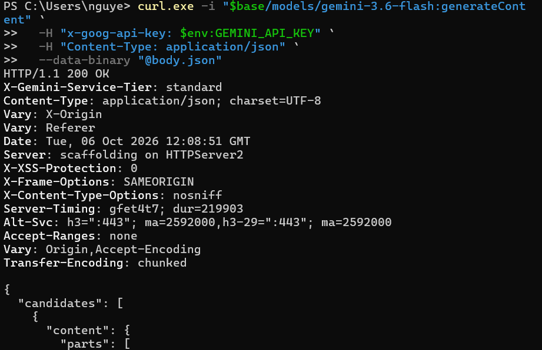
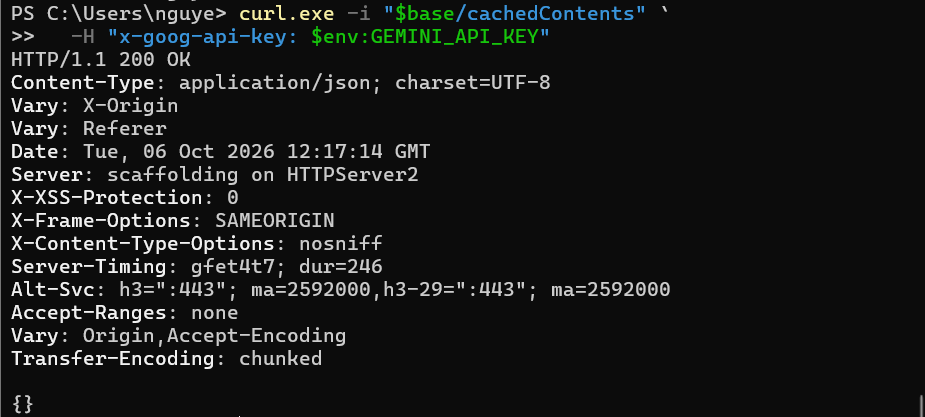
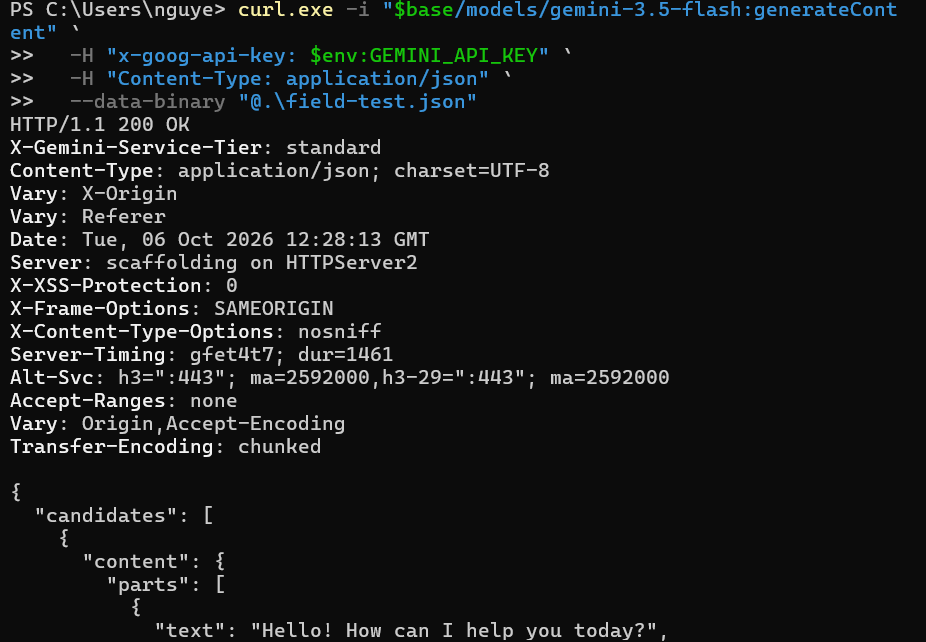
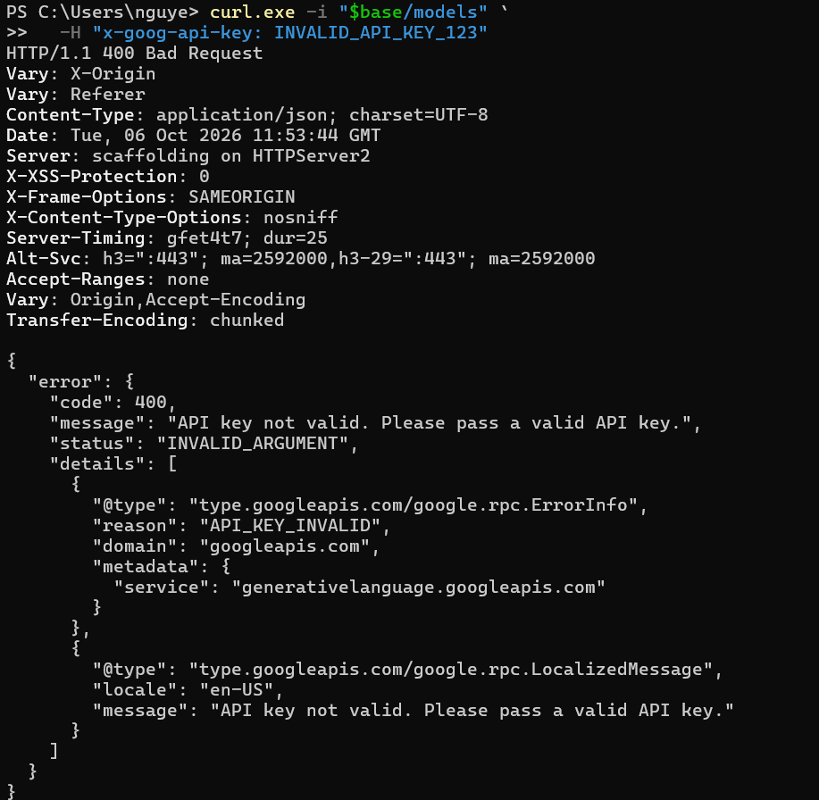
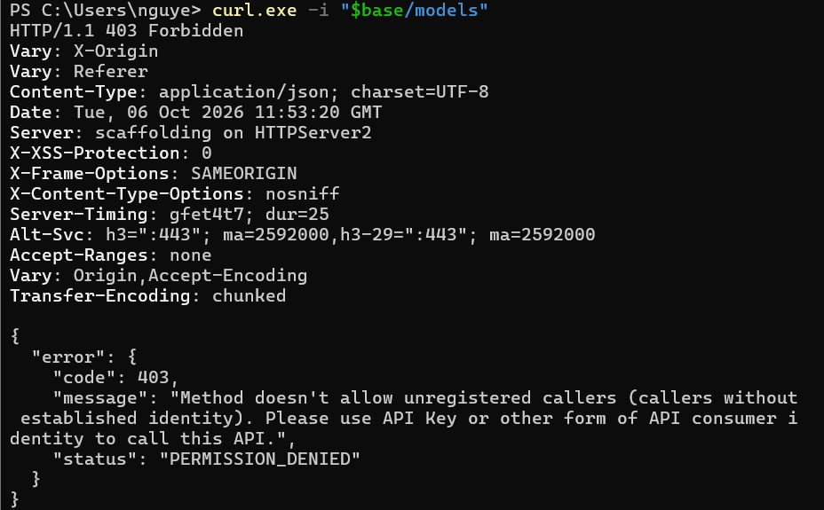
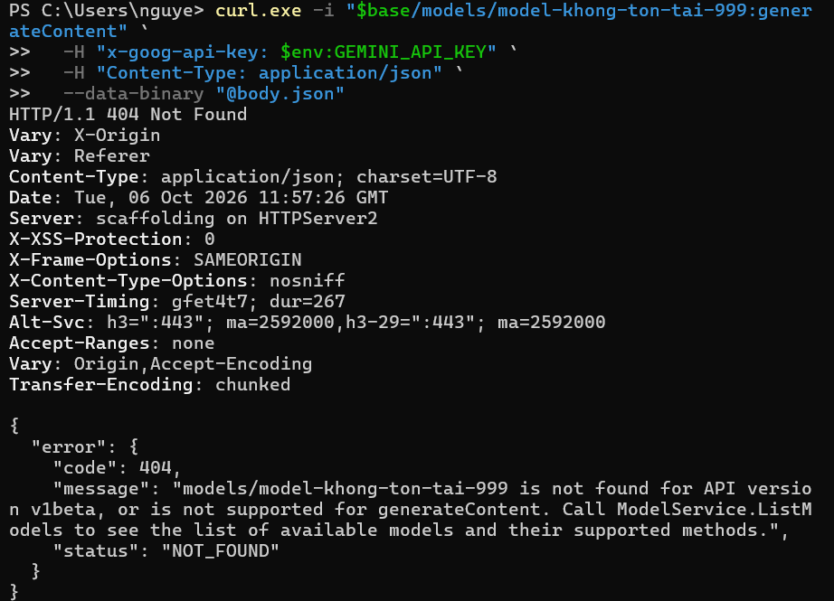
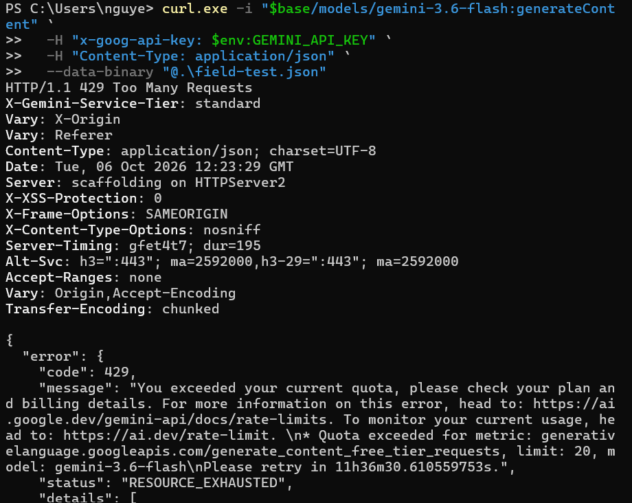
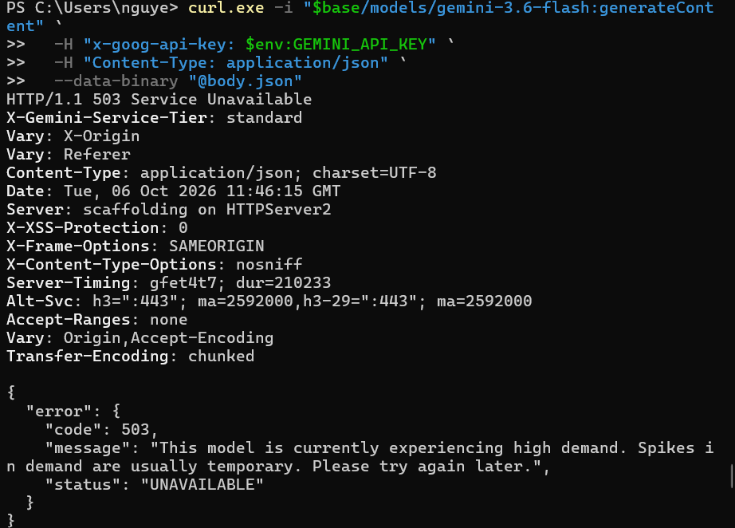

# Checklist review - Nhóm 6
---

API: [Google Gemini API - Models](https://ai.google.dev/gemini-api/docs/models)

| Tiêu chí | Kết quả | Note |
|----------|---------|------|
| **2. Naming nhất quán** | Không đạt | Path, field JSON và model ID chưa theo một quy ước duy nhất |
| **3. Status code đúng nghĩa** | Đạt một phần | Lỗi HTTP map đúng, nhưng nội dung bị chặn an toàn được trả trong body của response thành công |

## Tiêu chí 2: Naming nhất quán
---
Checklist: lowercase, kebab-case cho path, snake_case cho query, số nhiều cho collection.

**Đạt**
- Collection dùng số nhiều, lowercase: `models/*`, `files`
- Query param đơn giản, lowercase: `key`, `alt=sse`
- Có version trong path: `/v1beta/`
- Trang models công bố quy ước đặt tên model: stable / preview / latest / experimental

**Không đạt**

1. **Động từ camelCase nằm trong path** 
```
POST https://generativelanguage.googleapis.com/v1beta/{model=models/*}:generateContent
```


2. **Tên collection camelCase:**
`cachedContents/{cachedContent}`, phải là kebab-case (`cached-contents`)



3. **Field JSON trộn camelCase và snake_case.** Phần reference dùng camelCase, ví dụ curl của cùng trang dùng snake_case:

| Reference | Curl |
|-----------|------------|
| `systemInstruction` | `system_instruction` |
| `toolConfig` | `tool_config` |



## Tiêu chí 3: Status code đúng nghĩa
---
Checklist: mỗi response dùng code phù hợp, không trả 200 kèm lỗi trong body.

**Đạt:** với request thường, API set đúng HTTP status và trả `{"error": {"code", "message"}}`

| Trường hợp           | Test     | Kết quả                                |
| -------------------- | -------: | -------------------------------------- |
| Không có API key     |      403 | `PERMISSION_DENIED`                    |
| API key không hợp lệ |      400 | `INVALID_ARGUMENT` + `API_KEY_INVALID` |
| Vượt quota           |      429 | `RESOURCE_EXHAUSTED`                   |
| Model không tồn tại  |      404 | `NOT_FOUND`                            |
| Service đang quá tải |      503 | `UNAVAILABLE`                          |









